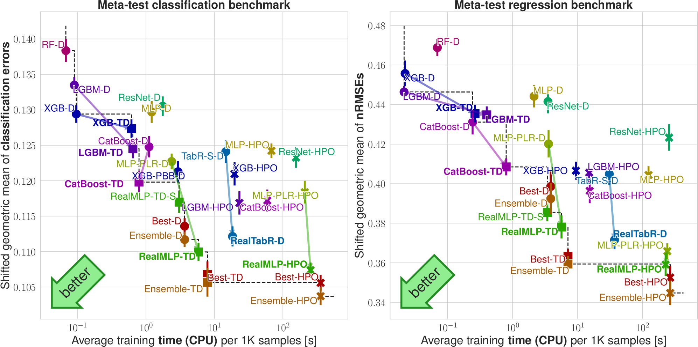

[](https://colab.research.google.com/github/dholzmueller/pytabkit/blob/main/examples/tutorial_notebook.ipynb)
[](https://pytabkit.readthedocs.io/en/latest/)

# PyTabKit: Tabular ML models and benchmarking

[Paper](arxiv.org/abs/2407.04491) | [Documentation](https://pytabkit.readthedocs.io) | [RealMLP-TD-S standalone implementation](github.com/dholzmueller/realmlp-td-s_standalone)   | [Grinsztajn et al. benchmark code](https://github.com/LeoGrin/tabular-benchmark/tree/better_by_default) | [Data archive](https://doi.org/10.18419/darus-4255) |
| --- | --- |---------------------------------------------------------------------------------------------|---------------------------------------------------------------------------------------------------------------------------------------------------------------------------------------------------| --- |

PyTabKit provides **scikit-learn interfaces for modern tabular classification and regression methods**
benchmarked in our [paper](arxiv.org/abs/2407.04491), see below. 
It also contains the code we used for **benchmarking** these methods 
on our meta-train and meta-test benchmarks.



## Installation

```commandline
pip install pytabkit
```
- If you want to use **TabR**, you have to manually install faiss,
which is only available on **conda**.
- Install torch separately if you want to control the version (CPU/GPU etc.)
- Use `pytabkit[full]` to also install the **benchmarking** library part. 
See also the [documentation](https://pytabkit.readthedocs.io).

## Using the ML models
Most of our machine learning models are directly available via scikit-learn interfaces.
For example, you can use RealMLP-TD for classification as follows:

```python
from pytabkit.models.sklearn.sklearn_interfaces import RealMLP_TD_Classifier

model = RealMLP_TD_Classifier()  # or TabR_S_D_Classifier, CatBoost_TD_Classifier, etc.
model.fit(X_train, y_train)
model.predict(X_test)
```
The code above will automatically select a GPU if available, 
try to detect categorical columns in dataframes, 
preprocess numerical variables and regression targets (no standardization required),
and use a training-validation split for early stopping. 
All of this (and much more) can be configured through the constructor 
and the parameters of the fit() method. 
For example, it is possible to do bagging 
(ensembling of models on 5-fold cross-validation)
simply by passing `n_cv=5` to the constructor. 
Here is an example for some of the parameters that can be set explicitly:

```python
from pytabkit.models.sklearn.sklearn_interfaces import RealMLP_TD_Classifier

model = RealMLP_TD_Classifier(device='cpu', random_state=0, n_cv=1, n_refit=0,
                              verbosity=2, val_metric_name='cross_entropy',
                              n_epochs=256, batch_size=256, hidden_sizes=[256] * 3,
                              lr=0.04, use_ls=False)
model.fit(X_train, y_train, val_idxs=val_idxs, cat_features=cat_features)
model.predict_proba(X_test)
```
See [this notebook](https://colab.research.google.com/github/dholzmueller/pytabkit/blob/main/examples/tutorial_notebook.ipynb)
for more examples. Missing numerical values are currently *not* allowed and need to be imputed beforehand.

### Available ML models

Our ML models are available in up to three variants, all with best-epoch selection: 
- library defaults (D)
- our tuned defaults (TD)
- random search hyperparameter optimization (HPO), sometimes also tree parzen estimator (HPO-TPE)

We provide the following ML models:

- **RealMLP** (TD, HPO): Our new neural net models with tuned defaults (TD) 
or random search hyperparameter optimization (HPO)
- **XGB**, **LGBM**, **CatBoost** (D, TD, HPO, HPO-TPE): Interfaces for gradient-boosted 
tree libraries XGBoost, LightGBM, CatBoost
- **MLP**, **ResNet** (D, HPO): Models from [Revisiting Deep Learning Models for Tabular Data](https://proceedings.neurips.cc/paper_files/paper/2021/hash/9d86d83f925f2149e9edb0ac3b49229c-Abstract.html)
- **TabR-S** (D): TabR model from [TabR: Tabular Deep Learning Meets Nearest Neighbors](https://openreview.net/forum?id=rhgIgTSSxW)
- **Ensemble-TD**: Weighted ensemble of all TD models (RealMLP, XGB, LGBM, CatBoost)

## Benchmarking code

Our benchmarking code has functionality for
- dataset download
- running methods highly parallel on single-node/multi-node/multi-GPU hardware,
with automatic scheduling and trying to respect RAM constraints
- analyzing/plotting results

For more details, we refer to the [documentation](https://pytabkit.readthedocs.io).

## Citation

If you use this repository for research purposes, please cite our [paper](arxiv.org/abs/2407.04491):
```
@article{holzmuller2024better,
  title={Better by default: Strong pre-tuned MLPs and boosted trees on tabular data},
  author={Holzm{\"u}ller, David and Grinsztajn, Leo and Steinwart, Ingo},
  journal={arXiv preprint arXiv:2407.04491},
  year={2024}
}
```

## Contributors

- David Holzmüller (main developer)
- Léo Grinsztajn (deep learning baselines, plotting)
- Ingo Steinwart (UCI dataset download)
- Katharina Strecker (PyTorch-Lightning interface)

## Acknowledgements
Code from other repositories is acknowledged as well as possible in code comments. 
Especially, we used code from https://github.com/yandex-research/rtdl 
and sub-packages (Apache 2.0 license),
code from https://github.com/catboost/benchmarks/
(Apache 2.0 license), 
and https://docs.ray.io/en/latest/cluster/vms/user-guides/community/slurm.html 
(Apache 2.0 license).
